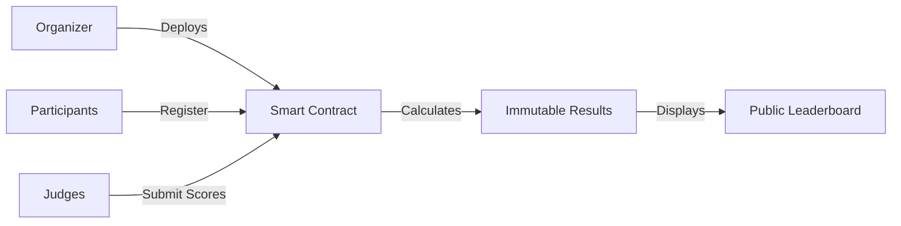

<div align="center">

```ascii
     ██╗██╗   ██╗██████╗ ██╗   ██╗██╗  ██╗
     ██║██║   ██║██╔══██╗╚██╗ ██╔╝╚██╗██╔╝
     ██║██║   ██║██████╔╝ ╚████╔╝  ╚███╔╝ 
██   ██║██║   ██║██╔══██╗  ╚██╔╝   ██╔██╗ 
╚█████╔╝╚██████╔╝██║  ██║   ██║   ██╔╝ ██╗
 ╚════╝  ╚═════╝ ╚═╝  ╚═╝   ╚═╝   ╚═╝  ╚═╝
```

### **Decentralized Hackathon Judging • Zero Bias • 100% Verifiable**

[🌐 Live Platform](https://GT-juryx.vercel.app/) • [📦 Repository](https://github.com/2405Gaurav/GT-juryx.git) • [📄 License: MIT](LICENSE)

---

**⚡ The Problem:** Hackathon judging is broken. Bias creeps in. Manual scoring fails. Results get questioned.

**✨ The Solution:** Blockchain-enforced fairness. Every score is immutable. Every result is transparent.

</div>

---

## 🎯 What Makes JuryX Different

<table>
<tr>
<td width="50%">

**🔒 IMMUTABLE SCORING**

Smart contracts lock in every judge's decision permanently. No backdoors. No alterations. Not even organizers can change submitted scores.

</td>
<td width="50%">

**👁️ RADICAL TRANSPARENCY**

Every scoring metric lives on-chain. Participants can verify exactly how they were evaluated. Trust through code, not promises.

</td>
</tr>
<tr>
<td width="50%">

**🎭 BIAS ELIMINATION**

Judges score independently with zero visibility into others' evaluations until the round closes. Pure merit wins.

</td>
<td width="50%">

**⚡ INSTANT FINALITY**

Smart contracts calculate winners automatically. No spreadsheets. No delays. Results go live the moment judging ends.

</td>
</tr>
</table>

---

## 🏗️ Architecture Blueprint



**Blockchain Core**
```
Solidity Contracts → Ethereum/Polygon → Hardhat Toolkit
```

**Frontend Experience**
```
Next.js + React → Tailwind CSS → Framer Motion → WebContainers
```

**Backend Operations**
```
Node.js/Express → IPFS Storage → Vercel Deployment
```

---

## 💎 Feature Showcase

### Judge Panel Experience
```
✓ Unique access codes per judge
✓ Weighted scoring metrics (customizable)
✓ Live project preview with WebContainers
✓ No crypto knowledge required
✓ Transaction signing made simple
```

### Organizer Control Center
```
✓ Event creation & round management
✓ Secret entry code generation
✓ Panelist assignment dashboard
✓ Real-time monitoring
✓ Permission management
```

### Participant Journey
```
✓ Wallet-based registration
✓ Team formation tools
✓ Repository linking (GitHub/GitLab)
✓ Project upload to IPFS
✓ Live leaderboard tracking
```

---

## 📊 Visual Gallery

<div align="center">

### Landing Experience


### Judge Interface


</div>

---

## 🔄 The JuryX Workflow

```
STEP 1 → Organizer deploys event smart contract
         ↓
STEP 2 → Participants register with Web3 wallet
         ↓
STEP 3 → Teams form and upload project materials
         ↓
STEP 4 → Judges receive access codes
         ↓
STEP 5 → Independent scoring via signed transactions
         ↓
STEP 6 → Smart contract aggregates all scores
         ↓
STEP 7 → Winner announced on immutable leaderboard
```

---

## 🚀 Quick Start Guide

**System Requirements**
- Node.js v18 or higher
- MetaMask or compatible Web3 wallet
- Git installed

**Launch Commands**

```bash
# Clone the repository
git clone https://github.com/Targter/JURYX-BLOCKCHAIN.git

# Navigate to project
cd JURYX-BLOCKCHAIN

# Install dependencies
npm install

# Configure environment
cp .env.example .env.local

# Start development server
npm run dev
```

Access the platform at `http://localhost:3000`

---

## 🌐 Technology Stack

| Layer | Technologies |
|-------|-------------|
| **Smart Contracts** | Solidity, Hardhat, Ethereum/Polygon |
| **Frontend** | Next.js 14, React 18, TypeScript |
| **Styling** | Tailwind CSS, Framer Motion |
| **Backend** | Node.js, Express API |
| **Storage** | IPFS, Web3.Storage |
| **Deployment** | Vercel, Infura |
| **Dev Tools** | WebContainers, ESLint, Prettier |

---

## 🎪 Core Principles

> **Decentralization First**
> No single point of failure. No central authority can manipulate outcomes.

> **Code is Law**
> Smart contracts enforce rules automatically. Human bias eliminated.

> **Privacy in Judging**
> Judges operate independently until round closure ensures uninfluenced decisions.

---

## 📜 License & Contributions

Released under the **MIT License** • Open for contributions • Built for the Web3 community

<div align="center">

**Made with ⚡ by developers who believe in fair competition**

[](https://github.com/Targter/JURYX-BLOCKCHAIN)

</div>